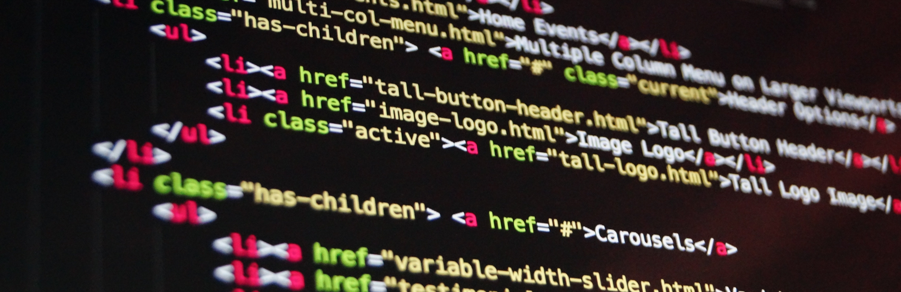
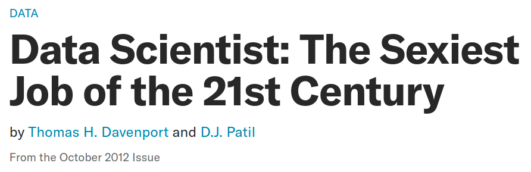
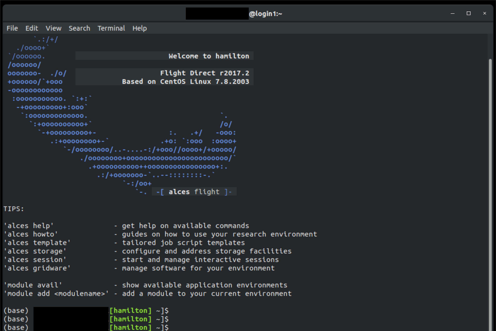

```{r setup, include = FALSE}
library(tidyverse)
library(gganimate)
library(RColorBrewer)
library(knitr)
library(DiagrammeR)
```

<!-- adding bold and italic options -->
<style>
em {
  font-style: italic
}
strong {
  font-weight: bold;
}
</style>

## Data analysis 1

  - Organisation
  - Why is data analysis important?
  - Computers and data analysis
  - Variables
  - Collecting data
  - Organising data in a table

--- .segue .dark 

## Organisation

--- &vcenter

## What will you learn?

```{r, out.width = "100%", out.height = "100%", dpi = 600, fig.align = "center", echo = FALSE}
flow <-  grViz("digraph {

graph [layout = dot, rankdir = LR]

# define the global styles of the nodes. We can override these in box if we wish
node [shape = rectangle, style = filled, fillcolor = lightblue]

a [label = 'Ask \n question']
b [label =  'Design \n experiment']
c [label = 'Gather \n data']


d [label= 'Analyse \n data', fillcolor=yellow, shape=oval]
e [label= 'Answer \n question']


# edge definitions with the node IDs
a -> b -> c -> d -> e
}", width = 4000)

flow
```

--- .class #id

## Organisation

- 4 online lectures
- Seminar 1: `Excel` and `R`. Online with optional drop in
- Seminar 2: `R`. Online with optional drop in
- Revision session
  
```{r, out.width = "100%", dpi = 300, echo = FALSE}
include_graphics("./assets/img/learn_wide.png")
```

--- .class #id

## How do you access software?

- Software: `Excel` and `R` running through `Rstudio`
- NTU supported Virtual Machines
- All you need is a computer, internet connection and a web browser (e.g. `Chrome`, `FireFox`)
- At home or on campus
- Full instructions later

```{r, out.width = "100%", dpi = 300, echo = FALSE}

```

--- .class #id

## Where can you find additional information?

- Discussion boards on `NOW` (post anonymously)
- Web resources e.g. www.khanacademy.org
- Library: www.ntu.ac.uk/m/library
- General statistics: *Data Analysis and Statistics with* `R`. https://dzchilds.github.io/stats-for-bio/
- More advanced bioinformatics: `R` *for Data Science*. https://r4ds.had.co.nz/

```{r, out.width = "100%", dpi = 300, echo = FALSE, }
include_graphics("./assets/img/adult_learning.png")
```

--- .segue .dark 

## Why is data analysis important?

--- .class #id

## The human mind works statistically

<q> The brain produces feelings of confidence that inform decisions the same way statistics pulls patterns out of noisy data </q>

Cold Spring Harbor Laboratory. ScienceDaily, 4 May 2016.

--- .class #id

## Supermarket X is cheaper than supermarket Y

```{r, out.width = "100%", dpi = 300, echo = FALSE, }
include_graphics("./assets/img/supermarket.png")
```

--- &twocol

## Lab work also requires data analysis

*** =left

- Quantitative PCR
- Quantify gene expression
- Or viral load

```{r, out.width = "100%", dpi = 300, echo = FALSE, fig.cap='plotting example'}
include_graphics("./assets/img/Qpcr-cycling.png", )
```
*Zuzanna K. Filutowska, CC BY-SA 3.0*

*** =right

```{r, out.width = "70%", dpi = 300, echo = FALSE, fig.align='center'}
include_graphics("./assets/img/pipette.JPG")
```

--- .class #id

## Phosphate Assay lab

```{r, out.width = "95%", dpi = 300, echo = FALSE, fig.align='center'}

```

--- .class #id

## Also a tool for science communication

<q>France seeing exponential rise...</q>

<q>Flattening the Coronavirus curve...</q>

<q>R number is now between 1.1 and 1.4...</q>

--- .class bg:white

## Also a tool for science communication

<iframe src = 'https://coronavirus.data.gov.uk/' height='600px'></iframe>

--- .segue .dark 

## Computers and data analysis

--- .class #id

## In school/college, you may have used these

```{r, out.width = "80%", dpi = 300, echo = FALSE, fig.align='center'}
include_graphics("./assets/img/calculator-2391810.jpg")
```

--- .class #id

## Modern science relies on computers

```{r, out.width = "70%", dpi = 300, echo = FALSE, fig.align='center'}
include_graphics("./assets/img/thinkpad-computer-1155173.png")
```

--- .class #id

## Bioinformatics and data science

- Biology + informatics
- Computational analysis of biological data
- A key part of modern biological research
- Links biology, computer science, mathematics and statistics
- Part of the emerging field of data science

```{r, out.width = "70%", dpi = 300, echo = FALSE}

```

*Harvard Business Review*

--- &twocol

## Case study: Genomics

*** =left

**The human genome**

- DNA comprising pairs of nucleotide bases
- 3,600,000,000 total base-pairs
- 3.6 Gigabases
- 2 copies per cell
- ~2 metres of DNA

**This represents**

- 1,028,571 pages of text
- 80 boxes of copier paper
- 1,096 years of typing

*** =right

```{r, out.width = "100%", dpi = 300, echo = FALSE}
include_graphics("./assets/img/Dna-base-flipping.svg")
```

*Magladem96, CC BY-SA 3.0*

--- &twocol

## Case study: Genomics

*** =left

**This Illumina NovaSeq 6000 produces:**
- 40 billion DNA sequences (20,000,000,000)
- each 150 bp in length
- 6,000 Gigabases of data
- equivalent to ~1,600 human genomes
- in < 2 days

*** =right

```{r, out.width = "70%", dpi = 300, echo = FALSE}
include_graphics("./assets/img/NovaSeq_6000.jpg")
```

*Magnus Manske, CC BY-SA 4.0*

--- &twocol

## Bioinformatics means you can play with cool kit

*** =left

```{r, out.width = "100%", dpi = 300, echo = FALSE, fig.align='center'}
include_graphics("./assets/img/apple-1282241.jpg")
```

**Laptop**

- 6 CPUs
- 16 Gb RAM
- 0.5 Tb Disc space

*** =right

```{r, out.width = "100%", dpi = 300, echo = FALSE}

```

**Hamilton**

- 512 CPUs
- 4 Tb RAM (4,000 Gb)
- 67 Tb Disc space

--- &twocol

## Software: `Microsoft Excel`

*** =left

- Spreadsheet based program
- Widely used across many professions
- Grid of **cells**
- Arranged in **rows** and **columns**
- Cells can contain **data** or **functions**
- Can produce graphs
- Can perform various statistical tests and analyses
- Proprietary software
- Max 1,048,576 rows by 16,384 columns
- Max 2Gb file size

*** =right

```{r, out.width = "40%", dpi = 300, echo = FALSE, fig.align='center'}
include_graphics("./assets/img/Microsoft_Office_Excel_(2018–present).svg")
```

```{r, out.width = "100%", dpi = 300, echo = FALSE}
include_graphics("./assets/img/Microsoft_Excel.png")
```

*Used with permission from* `Microsoft`.

--- &twocol

## Software: `R`

*** =left

- **Programming language**
- Executed through the **command line**
- Or `Rstudio` environment
- Fully **open source**
- Many add-on **packages**
- Can handle very large files
- Vast range of analyses
- High quality graphs and diagrams
- Websites
- Reports
- This presentation!


*** =right

```{r, out.width = "30%", dpi = 300, echo = FALSE, fig.align='center'}

```

*CC-BY-SA 4.0*

```{r, out.width = "100%", dpi = 300, echo = FALSE}
include_graphics("./assets/img/Rstudio.png")
```

*PAC2, AGPL*


--- .class bg:white

## Try doing this in `Excel` ;)

```{r, out.width = "95%", out.height = "95%", fig.width = 8, fig.height = 4.75, dpi = 600, fig.align = "center", echo = FALSE}
# get data as tibble
height_data <- read_tsv("./data/Galton.txt",
  col_types= cols(
    Family = col_character(),
    Father = col_double(),
    Mother = col_double(),
    Gender = col_character(),
    Height = col_double(),
    Kids = col_integer()
  )
)

# convert inches: metres = inch/39.37
height_m <- mutate(height_data,
  fth = Father / 39.37,
  mth = Mother / 39.37,
  hgt = Height / 39.37
)

# histogram of heights
all_hist <- ggplot(height_m) +
  geom_histogram(aes(x = hgt), binwidth = 0.035, colour = "black", fill = "coral") +
  theme_bw(base_size = 15) +
  labs(x="height (m)", y="count")

# animate plot
anim <- all_hist +
  transition_states(Gender, 
    transition_length = 1,
    state_length = 1
  ) +
  ease_aes('cubic-in-out')

anim

```

--- .segue .dark 

## Variables

--- .class #id bg:white

## Science finds things that affect other things

```{r, out.width = "80%", dpi = 300, echo = FALSE, fig.align='center'}
  
```

--- .class #id bg:white

## Science finds things that affect other things

```{r, out.width = "85%", dpi = 300, echo = FALSE, fig.align='center'}
include_graphics("./assets/img/agar-60571.jpg")
```

--- .class #id bg:white

## Science finds things that affect other things

```{r, out.width = "90%", dpi = 300, echo = FALSE}
include_graphics("./assets/img/red-eye-frog-2815683.png")
```

--- .class #id 

## These things are called variables

### A variable is something that can be measured or counted

**There are three main types:**

1. Categorical variables

2. Ordinal variables

3. Quantitative variables
  - Continuous
  - Discrete

### The type of variable determines how data should be analysed and visualised

--- .class #id 

## Categorical variables

*[Can be referred to as qualitative or nominal variables]*

  >- Things that have distinct categories
  >- Qualitative (assigned or named, not quantified)
  >- A fixed (or limited) number of possibilities
  >- Categories cannot be divided or multiplied
  >- Examples: 
    + Presence/absence of anything
    + DNA nucleotides
    + species

--- .class #id 

## Ordinal variables

*[Can be referred to as ranked variables]*

  >- Things that can be ranked
  >- Categories that can be put in a sequence
  >- Qualitative (assigned or named, not quantified)
  >- A fixed (or limited) number of possibilities
  >- Categories cannot be divided or multiplied
  >- But we can identify a middle value
  >- Examples: 
    + Often used in questionnaires, e.g. dislike, indifferent, like
    + Degrees: BSc, MSc, PhD

--- .class #id 

## Quantitative variables

*[Can be referred to as numeric, interval or ratio variables]*

  >- Things that can be measured numerically
  >- Typically have **units**
  >- Values can be divided or multiplied
  >- **Continuous**
    + An infinite number of possibilities
    + Accuracy only limited by the experimental method
    + Temperature, distance, speed, time
  >- **Discrete**
    + Numerical measurements where only certain values are possible
    + Counts, e.g. number of patients, molecules, etc.

--- .segue .dark 

## Collecting data

--- .class #id 

## Collecting data

### A variable is something that can be measured or counted

- Taking a measurement or count is an **observation**
- The information you collect is a **value** (or datum)
- All the values together are your **data**
- The number of observations is your **sample size** (often expressed as `N`)

### Sometimes you record multiple variables from the same thing
  - *Patient number = 1234, gender = M, age = 24, heart rate = 70 bpm*
  - Here we have data for 4 variables, but it is a **single observation**

--- .class #id 

## Observations should be independent

- One observation does not affect the other
- Lack of independence can cause the sample size to be misjudged
- This is called **pseudoreplication**

>- *You measure the blood pressure of a single person 100 times*
  - 100 measurements, sample size `N` = 1 person

>- *You measure the length of 100 leaves from the same tree*
  - 100 leaves, sample size `N` = 1 tree
  
>- Note before/after measurements are fine, but these pairs represent a single observation
>- *Patient blood pressure before & after drug treatment*
  - 2 blood pressure values, sample size `N` = 1 patient

--- .class #id 

## Samples should be collected at random

- We should not bias our observations towards particular categories or values
- Often one of the most difficult aspects of study design!
- Sometimes unavoidable, requiring careful analysis and interpretation

>- *You count the number of bird species in a woodland habitat and in a lake habitat*
  - Woodland birds are harder to see

>- *You work at an diabetes clinic. You investigate how many patients smoked prior to developing diabetes*
  - You work at an diabetes clinic: all your patients develop diabetes (some of whom happen to have smoked)

--- .segue .dark 

## Organising data in a table

--- .class #id 

## Tables

### Tables are an excellent way to organise, store and analyse our data
- The format is flexible, but generally:
  + Each **row** is an observation
  + Each **column** is a variable
  + The **top row** is the variable names

>- Tables can be created and saved in `Excel`, where further analysis can be carried out
>- Bioinformaticians tend to use plain text (space, comma or tab delimited)
>- This is an ideal data format for importing into `R`

--- .class #id 

## Example tables

### Beaver body temperature

```{r, echo = FALSE}
kable(beaver1[1:11,1:3])
```

--- .class #id 

## Example tables

### Beaver body temperature: plain text

```{r, echo = FALSE}
beaver1[1:11,1:3]
```

--- .class #id 

## Data analysis 1

  - Organisation
  - Why is data analysis important?
  - Computers and data analysis
  - Variables
  - Collecting data
  - Organising data in a table

--- &thankyou

## Next time

**Barcharts, histograms, averages, and variability**
